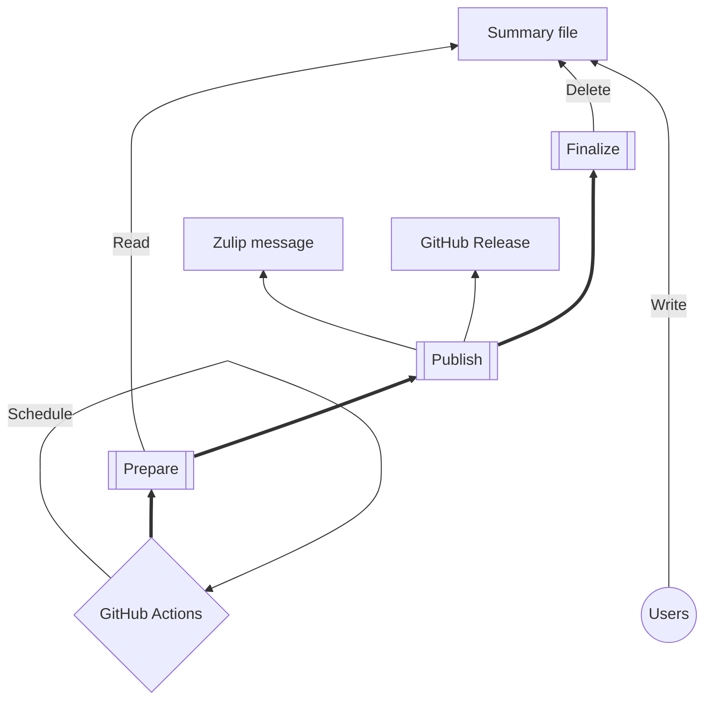
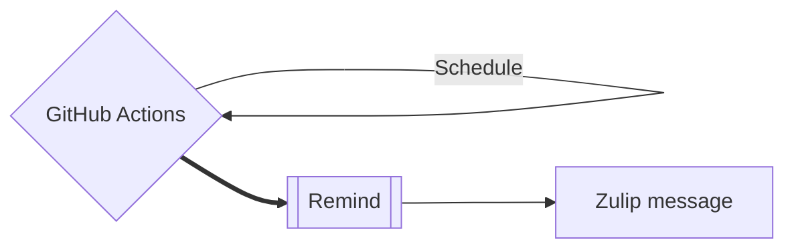

# [Template] What Do You Do?

## What is it?

**TL;DR "What Do You Do?" (abbr. WDYD) is a tool to help share your work items with others periodically and publicly.**

🚀 Say hello to "What Do You Do?" (WDYD)! The ultimate nosey, yet handy tool that keeps everyone in the loop with your team's work! 🕵️‍♂️

With WDYD, your teammates can document their work items, making it easy for everyone to stay in the loop! 🔄

Hop on the WDYD train and upgrade your team's communication game! 🌟

## How it works?

Simple!
People document their work items throughout the week (in free form) in the `SUMMARY.md` file, and the result is tagged/released on GitHub and published to Zulip automatically.
Afterward, a fresh summary file is commited.

There’s also a scheduled reminder to add the work items.

## Repository set-up

The following configuration is required for the tool to function.

### Variables

Define these [variables](https://docs.github.com/actions/learn-github-actions/variables):
- `PROJECT_TITLE`  
  To be used in summaries and release titles, e.g. `Team X Weekly Report`
- `ZULIP_BOT_EMAIL`  
  The e-mail address associated with your Zulip bot, e.g. `team-x-bot@balena.zulipchat.com`
- `ZULIP_BOT_NAME`  
  Arbitrary bot name, e.g. `TeamXBot`, which is used to commit a fresh summary file
- `ZULIP_ORGANIZATION_URL`  
  Most likely `https://balena.zulipchat.com`
- `ZULIP_PING`  
  Who to ping, e.g. `@*teamX*`, which is included in the Zulip reminder message
- `ZULIP_STREAM`  
  Stream name on Zulip, e.g. `aspect/teamX`
- `ZULIP_TOPIC`  
  Topic name on Zulip, e.g. `Team X - WDYD?`

### Secrets

Define these [secrets](https://docs.github.com/actions/automating-your-workflow-with-github-actions/creating-and-using-encrypted-secrets):
- `ZULIP_API_KEY`  
  The API key associated with your Zulip bot

### Schedules (optional)

Schedules are defined as CRON job GitHub action triggers.
By default:
- Reminders are triggered every Friday at 12.00PM UTC
- Publishing is triggered every Monday at 1.45PM UTC

These can be adjusted in [`remind.yml`](./.github/workflows/remind.yml) and [`publish.yml`](./.github/workflows/publish.yml) 
respectively.

## Examples

Some examples of the tool being used in the wild:
- https://github.com/people-os/analytics-wdyd
- https://github.com/people-os/people-ops-wdyd
